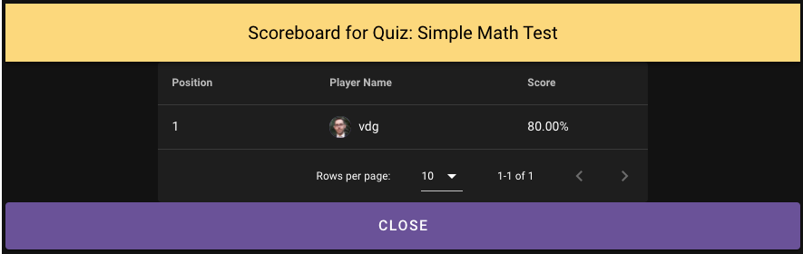

# Playing SimpleTriviaService (SimpleTriviaService)

Simple Trivia Service offers players the chance to create and play many different types of games. There are four types of games that players can play in Simple Trivia Service.

## Modes of Gameplay

There are four modes of gameplay in Simple Trivia Service. Single Player games are ones that players can play at any time after you run them and use an Amazon API Gateway HTTP endpoint.

Multiplayer - Casual and Multiplayer - Competitive games both use Amazon API Gateway WebSockets and requires a Host player to run the quiz, advancing answers and playing the role of an emcee. These modes allow all players to answer all questions and have one major difference which is the flow of the game. Multiplayer Casual games ask a question, show the answer, then show the scoreboard for each question. Multiplayer - Competitive games allow the Host to group questions together, much like you might find in a trivia contest in person. The Host will ask all the questions in a group, then show the answers for all questions in that group, and then the scoreboard after the group of questions is complete.

Multiplayer - Live Scoreboard mode uses AWS IoT and will only allow one player to win each question, much like a Jeopardy format.

## Types of Questions

There are two types of questions that can be asked, multiple choice and open answer. Multiple choice questions are ones in which you will provide between 2 and 4 answers to the player for them to choose from. You will identify which of the options is correct. Open Answer questions are ones in which the user must type the answer out. Open answer questions also have optional alternative answers, in which you can type a few answers that might be close enough to the correct answer to award points to a player.

# Navigation

Players interact with the main menu to take different actions in the game.

## Registration and Signin

Users are required to register and login to Simple Trivia Service. This activity is done via the signin page of the application. If a user is new, they can select the "Register" button and entering the requested infromation. Passwords, by default, require 8 characters, 1 upper case letter, 1 lower case letter, 1 number, and 1 special character.

## Successful Login

Upon a successful login, the user should see their name and two checked clouds in the upper right hand corner. The green icon signifies a connection to the WebSockets endpoint and the blue icon signifies a connection to the IoT endpoint. An icon that is not checked signifies the client could not make the connection to the endpoint.

## Main Menu

The main menu allows users to navigate to the main portions of the game, including chat, managing your games, managing your profile, playing games, running gmes, and the marketplace.

## Creating Games

To create games, click on the "Manage" button from the main menu. This will show you your current games. If you are a new player, you will not see any listed, such as:

![Image of Admin Edit Games])(images/admin_games.png)

If you have a game, a radio button will appear next to it for you to select it and take action on it, for instance to sell it on the marketplace or to edit the game. Editing your game is similar to creating a new game, except that fields will be prefilled.

To create a new game, click the "Create New" button. This will open the game header view where you can enter in the quiz name, description, number of questions, select the type of question, and the type of game.

![Image of Admin Game Header])(images/admin_game_header.png)

Once you enter in the game header information, click "Enter Questions" to enter questions. A multiple choice question might look like this:

![Image of Admin Game Question])(images/admin_game_question.png)

Continue entering questions until you enter all of your questions, clicking "Save Question" to save it to the database.

## Running a Single Player Game

Single Player games need to be run one time to start it. This gives you the opportunity to make sure your quiz is in the format you want it in before starting it. To run the game, click the "Run" button on the main menu and you will see a list of your quizzes. Find your Single Player game and click it. This will begin running the game and players will be able to find it when they play games.

![Image of Admin Run Game])(images/admin_host_question.png)

## Playing a Single Player Game

Players click on Play to start playing any game. The game selection screen will show all games that are currently live and the player can find a "Single Player" game that is being run.

Clicking on the name of the game will start it and the player will see the first question.

After responding to the last question in the quiz, the player will receive a message stating their score.

Afterwards, the player can also review the questions and their answers via the Answerboard.

Finally, the player can see where they rank all time for the quiz they just took on the Leaderboard.

## Running Multiplayer Games

Running Multiplayer games starts with clicking the "Run" button and selecting the multiplayer game you wish to host. Depending on the mode, you will see a screen similar to this which is the game lobby.

As players join, you will see either the counter go up or their names. When you are ready to ask the first question, click the "Start Game" button. This will inform the players the game is about to begin. You will then have another button for asking questions labeled "Ask Question." As you click this button, a question will be sent to all the players in the game. When you ask a question, you will see the page update.

You can control the flow, asking questions as soon as you desire or when a player/all players have responded. When the last question has been asked and the final scoreboard viewed, you will see a "Game Over" button. This button will end the game for all players and remove it from the "Play" window for new players.

## Playing Multiplayer Games

To play a multiplayer game, players need to click the "Play" button on the main menu and select the multiplayer game they wish to play. This requires that someone is hosting the multiplayer game. Players of these games enter the lobby when they join.

When the host asks a question, the players' view will change to display that question.

The player can then take the action of answering the question and will wait for the host to take the next action, which depends on the game type. For Multiplayer - Casual and Multiplayer - Competitive games, players will be moved to a "Waiting for Host" page. Mutiplayer - Live Scoreboard games will show the question winner and scoreboard to all players as soon as there is a correct answer.

At the end of the game, the players will see a final game leaderboard, showing them their rank in the current game.

## Chat

Players can chat amongst all connected players by clicking the "Chat" button. This will open a page similar to this:

