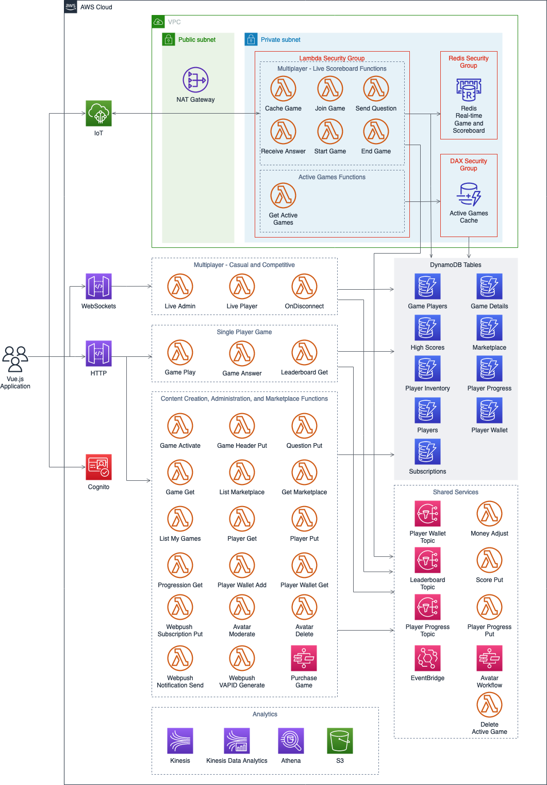

# Simple Trivia Service - a Serverless Single- and Multi-player Trivia Game 

This example application shows how to build both single and multiplayer games using Serverless architectures and managed services from AWS.  Information about how this project works and how serverless architectures perform was published in the following blogs:
* [Building a serverless multi-player game that scales](https://aws.amazon.com/blogs/compute/building-a-serverless-multiplayer-game-that-scales/).
* [Building a serverless multi-player game that scales](https://aws.amazon.com/blogs/compute/building-a-serverless-multiplayer-game-that-scales-part-2/)

Important: this application uses various AWS services and there are costs associated with these services after the Free Tier usage - please see the [AWS Pricing page](https://aws.amazon.com/pricing/) for details. You are responsible for any AWS costs incurred. No warranty is implied in this example.

## Game Architecture



## Project Organization

```bash
.
├── README.MD                   <-- This instructions file
├── backend                     <-- Source code for the serverless backend
├── frontend                    <-- Source code for the Vue.js frontend
```

## Release Notes

### Backend
1. The backend of Simple Trivia Service uses TypeScript/Node 18.x and the AWS SDK v2. This is the start of the full conversion to TypeScript. Not everything uses strong types in Simple Trivia Service today. There are some updates that are being looked at, including GameSparks and Step Functions, and some DynamoDB table optimizations, These changes will have impact on the types that are used. Types are planned to be added with these updates.
2. The bakcend is now set up in multiple, separate templates and are no longer nested. This enables faster innovation for developers looking to quickly expirement with the solution.
3. The Game Detail table has been retired and questions are now stored in the Player Inventory table.
4. WebPush backend has been removed and notifications now use an IoT topic for the individual player.

### Front End
1. The front end has been updated to use Vue3/Vuetify3 and Node 18.x.


### Roadmap
The following items are on the roadmap to be introduced in future versions. If you are interested, please contact @timbrucemi on Twitter.

1. Versus mode - will use GameLift FlexMatch stand-alone matchmaking to to introduce a player vs. player timed mode.
2. Investigating updates and alternatives for backend services to manage game state while still remaining serverless. This will focus on single player, multiplayer websockets, and multiplayer IoT.
3. Additions of strong types for functions using `any` data types.
4. Automated localization of player generated content/chat. Stretch goal will include localization of front end.

## Requirements

1. An [AWS Account](https://portal.aws.amazon.com/gp/aws/developer/registration/index.html)
2. [AWS CLI v.2.7.21 installed](https://docs.aws.amazon.com/cli/latest/userguide/cli-chap-install.html) and [configured](https://docs.aws.amazon.com/cli/latest/userguide/cli-chap-configure.html) with Admin privileges
3. [AWS SAM CLI v1.78 installed](https://docs.aws.amazon.com/serverless-application-model/latest/developerguide/serverless-sam-cli-install.html)
4. [NodeJS v18.x installed](https://nodejs.org/en/download/package-manager/)
5. [Vue.js and Vue CLI (v. 5.0.8) installed](https://vuejs.org/guide/quick-start.html)
6. [Create an IoT Endpoint in your account](https://docs.aws.amazon.com/iot/latest/developerguide/setting-up.html#iot-console-signin)
7. [jq is installed](https://stedolan.github.io/jq/download/)
7. Optional [AWS Amplify installed and configured to access the account you are using](https://docs.amplify.aws/cli/start/install)

## Installation Instructions

The installation instructions are broken down into two parts
    1. Simple Trivia Service backend deployment
    2. Simple Trivia Service frontend deployment

There are a number of steps in each part, which are described below.

### Backend Setup

This set of steps will deploy a number of AWS resources to your account, including DynamoDB tables, Lambda functions, API Gateway instances, and Cognito User Pools.

1. Create an [AWS Account](https://portal.aws.amazon.com/gp/aws/developer/registration/index.html) if you do not already have one.
2. Clone this repo using `git clone`.
3. Navigate to the `backend/Step1` directory. This template deploys DynamoDB Tables for Simple Trivia Service. Run the following commands:
    a. `sam deploy --stack-name sts-dt --guided` providing the following responses:
        1. Stack Name: `sts-dt`
        2. AWS Region: `<your region to deploy to, e.g. us-east-1>`
        3. Parameter LogRetentionDays: `7` or your value that follows [CloudWatch Log Retention Day Rules in CloudFormation](https://docs.aws.amazon.com/AWSCloudFormation/latest/UserGuide/aws-resource-logs-loggroup.html#cfn-logs-loggroup-retentionindays)
        4. Parameter ResourceGroupPrefix: `GameService-DB`
        6. Confirm changes before deploy: `N`
        7. Allow SAM CLI IAM role creation: `Y`
        8. Disable rollback: `N`
        9. Save arguments to configuration file: `Y`
        10. SAM configuration file: `samconfig.toml`
        11. AM configuration environment: `default`
4. Navigate to the `backend/Step2` directory. This template deploys some of the core utilities needed for Simple Trivia Service. Run the following commands:
    a. `sam build -u -p -t template.yaml`
    b. `sam deploy --stack-name sts --capabilities CAPABILITY_IAM CAPABILITY_NAMED_IAM --guided` providing the following responses:
        1. Stack Name: `sts`
        2. AWS Region: `<your region to deploy to, e.g. us-east-1>`
        3. Parameter LogRetentionDays: `7` or your value that follows [CloudWatch Log Retention Day Rules in CloudFormation](https://docs.aws.amazon.com/AWSCloudFormation/latest/UserGuide/aws-resource-logs-loggroup.html#cfn-logs-loggroup-retentionindays)
        4. Parameter ResourceGroupPrefix: `GameService`
        5. Parameter EMFNamespace: `STS`
        6. Confirm changes before deploy: `N`
        7. Allow SAM CLI IAM role creation: `Y`
        8. Disable rollback: `N`
        9. Save arguments to configuration file: `Y`
        10. SAM configuration file: `samconfig.toml`
        11. AM configuration environment: `default`
5. Navigate to the `backend/Step3` directory. This template deploys the analytics pipeline for Simple Trivia Service. Run the following commands:
    a. `sam build -u -p -t template.yaml`
    b. `sam deploy --stack-name sts-analytics --capabilities CAPABILITY_IAM CAPABILITY_NAMED_IAM --guided` providing the following responses:
        1. Stack Name: `sts-analytics`
        2. AWS Region: `<your region to deploy to, e.g. us-east-1>`
        3. Parameter ResourceGroupPrefix: `GameService`
        4. Parameter ServicePrefix: `sts-analytics`
        5. Parameter S3BufferInterval: `60`
        6. Parameter S3BufferSize: `5`
        7. Parameter SourceStreamSize: `1`
        8. Confirm changes before deploy: `N`
        9. Allow SAM CLI IAM role creation: `Y`
        10. Disable rollback: `N`
        11. Save arguments to configuration file: `Y`
        12. SAM configuration file: `samconfig.toml`
        13. AM configuration environment: `default`
7. Navigate to the `backend/Step4` directory. This template deploys the RESTful interface for Simple Trivia Service. Run the following commands:
    a. `sam build -u -p -t template.yaml`
    b. `sam deploy --stack-name sts-rest --capabilities CAPABILITY_IAM CAPABILITY_NAMED_IAM --guided` providing the following responses:
        1. Stack Name: `sts-rest`
        2. AWS Region: `<your region to deploy to, e.g. us-east-1>`
        3. Parameter EMFNamespace: `STS`
        4. Parameter LogRetentionDays: `7` or your value that follows [CloudWatch Log Retention Day Rules in CloudFormation](https://docs.aws.amazon.com/AWSCloudFormation/latest/UserGuide/aws-resource-logs-loggroup.html#cfn-logs-loggroup-retentionindays)
        5. Parameter ResourceGroupPrefix: `GameService`
        6. Confirm changes before deploy: `N`
        7. Allow SAM CLI IAM role creation: `Y`
        8. Disable rollback: `N`
        9. Save arguments to configuration file: `Y`
        10. SAM configuration file: `samconfig.toml`
        11. AM configuration environment: `default`
8. Navigate to the `backend/Step5` directory. This template deploys the API Gateway WebSockets solution for Simple Trivia Service. Run the following commands:
    a. `sam build -u -p -t template.yaml`
    b. `sam deploy --stack-name sts-ws --capabilities CAPABILITY_IAM CAPABILITY_NAMED_IAM --guided` providing the following responses:
        1. Stack Name: `sts`
        2. AWS Region: `<your region to deploy to, e.g. us-east-1>`
        3. Parameter LogRetentionDays: `7` or your value that follows [CloudWatch Log Retention Day Rules in CloudFormation](https://docs.aws.amazon.com/AWSCloudFormation/latest/UserGuide/aws-resource-logs-loggroup.html#cfn-logs-loggroup-retentionindays)
        4. Parameter ResourceGroupPrefix: `GameService`
        5. Parameter EMFNamespace: `STS`
        6. Confirm changes before deploy: `N`
        7. Allow SAM CLI IAM role creation: `Y`
        8. Disable rollback: `N`
        9. Save arguments to configuration file: `Y`
        10. SAM configuration file: `samconfig.toml`
        11. AM configuration environment: `default`
8. Navigate to the `backend/Step6` directory. This template deploys the IoT WebSockets over MQTT solution for Simple Trivia Service. Run the following commands:
    a. `sam build -u -p -t template.yaml`
    b. `sam deploy --stack-name sts-iot --capabilities CAPABILITY_IAM CAPABILITY_NAMED_IAM --guided` providing the following responses:
        1. Stack Name: `sts-iot`
        2. AWS Region: `<your region to deploy to, e.g. us-east-1>`
        3. Parameter LogRetentionDays: `7` or your value that follows [CloudWatch Log Retention Day Rules in CloudFormation](https://docs.aws.amazon.com/AWSCloudFormation/latest/UserGuide/aws-resource-logs-loggroup.html#cfn-logs-loggroup-retentionindays)
        5. Parameter EMFNamespace: `STS`
        6. Confirm changes before deploy: `N`
        7. Allow SAM CLI IAM role creation: `Y`
        8. Disable rollback: `N`
        9. Save arguments to configuration file: `Y`
        10. SAM configuration file: `samconfig.toml`
        11. AM configuration environment: `default`
    Note: This stack may cause your security token to timeout. If so, you can track progress in the CloudFormation console.
9. Navigate to the `backend/Step7` directory. Run the script `generateAWSConfig.sh` to generate the AWSConfig.js file that you will need for the front end.
10. Copy the `AWSConfig.js` file you just created to `frontend/src/services/AWSConfig.js`.

### Frontend Setup

These steps will configure the Qwizardly UI to utilize the features deployed during the Backend Setup.
1. Navigate to the `serverless-trivia-game/frontend` directory.
2. Run the command `npm i` to install dependencies.
4. Run the command `npm run serve` to run the webapp locally.
5. Once the app is running, navigate to http://localhost:8080 to use the Simple Trivia Service frontend.

### Optional: Host the Simple Trivia Service frontend using Amplify

1. Navigate to the serverless-trivia-game/frontend/
2. Run the command `amplify init` to initialize the application and use the following values:
```
    Enter a name for the project: stsui
    Enter a name for the environment: dev
    Choose your default editor: (Use arrow keys to select your code editor)
    Choose the type of app that you're building: javascript
    What javascript framework are you using: vue
    Source Directory Path: src
    Distribution Directory Path: dist
    Build Command: npm run-script build
    Start Command: npm run-script serve
    Do you want to use an AWS profile? Y
    Please choose the profile you want to use: (select the profile you setup when configuring Amplify in the pre-requisites)
```
3. Run the command `amplify add hosting` to initiate the creation of hosting for the application.  Use the following options:
```
    Select the plugin module to execute: Hosting with Amplify Console (Managed hosting with custom domains, Continuous deployment)
    Choose a type: Manual deployment 
```
4. Run the command `amplify publish` to publish your application.  Amplify will return a URL like "https://dev.[amplifyid].amplify.com" where you can see the running application.

## Playing Simple Trivia Service

See the [Playing Simple Trivia Service](PLAYING_STS.md) file

## Next Steps

If you have any feedback, feature ideas, or updates, please reach out via a github issue or a pull request.  Note that you will need to offer the ability for AWS to use any code you submit.

## Clean-up

Remove the stack using the following commmands:

### Delete the Amplify Application
1. Type the command `amplify delete` from the serverless-trivia-game/frontend directory.

### Delete the Backend Services
1. Type the command `aws cloudformation delete-stack --stack-name sts-iot`
2. Type the command `aws cloudformation delete-stack --stack-name sts-ws`
3. Type the command `aws cloudformation delete-stack --stack-name sts-rest`
4. Type the command `aws cloudformation delete-stack --stack-name sts-analytics`
5. Type the command `aws cloudformation delete-stack --stack-name sts`
6. Type the command `aws cloudformation delete-stack --stack-name sts-dt`

Some of the stacks, namely sts-rest and sts-analtyics, contain S3 buckets that will not be deleted if they contain data. If this occurs to you, navigate to the CloudFormation console and find the stacks. Select the resources tab and carefully empty the buckets that remain as resources in the stack before trying to delete the stack again.

Copyright 2020 Amazon.com, Inc. or its affiliates. All Rights Reserved.

SPDX-License-Identifier: MIT-0