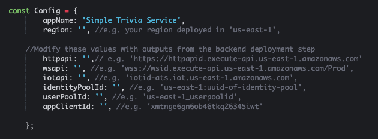

# Simple Trivia Service - a Serverless Single- and Multi-player Trivia Game 

This example application shows how to build both single and multiplayer games using Serverless architectures and managed services from AWS.  Information about how this project works and how serverless architectures perform was published on the blog [Building a serverless multi-player game that scales](https://aws.amazon.com/blogs/compute/building-a-serverless-multiplayer-game-that-scales/).

Important: this application uses various AWS services and there are costs associated with these services after the Free Tier usage - please see the [AWS Pricing page](https://aws.amazon.com/pricing/) for details. You are responsible for any AWS costs incurred. No warranty is implied in this example.

## Project Organization

```bash
.
├── README.MD                   <-- This instructions file
├── backend                     <-- Source code for the serverless backend
├── frontend                    <-- Source code for the Vue.js frontend
```

## Requirements

1. An [AWS Account](https://portal.aws.amazon.com/gp/aws/developer/registration/index.html)
2. [AWS CLI v1.18 installed](https://docs.aws.amazon.com/cli/latest/userguide/cli-chap-install.html) and [configured](https://docs.aws.amazon.com/cli/latest/userguide/cli-chap-configure.html) with Admin privileges
3. [AWS SAM CLI v1.15 installed](https://docs.aws.amazon.com/serverless-application-model/latest/developerguide/serverless-sam-cli-install.html)
4. [AWS CDK v1.57.0 installed](https://docs.aws.amazon.com/cdk/latest/guide/getting_started.html#getting_started_install)
5. [NodeJS v12.x installed](https://nodejs.org/en/download/package-manager/)
6. [Vue.js and Vue CLI (v. 4.5) installed](https://vuejs.org/v2/guide/installation.html)
7. [Create an IoT Endpoint in your account](https://docs.aws.amazon.com/iot/latest/developerguide/setting-up.html#iot-console-signin)
8. Optional [AWS Amplify installed and configured to access the account you are using](https://docs.amplify.aws/cli/start/install)

## Installation Instructions

The installation instructions are broken down into three parts, starting with the backend, deploying a dashboard, and concluding with the frontend.

### Backend Setup

This set of steps will deploy a number of AWS resources to your account, including DynamoDB tables, Lambda functions, API Gateway instances, and Cognito User Pools.

1. Create an [AWS Account](https://portal.aws.amazon.com/gp/aws/developer/registration/index.html) if you do not already have one.
2. Clone this repo using `git clone`.
3. Use the command `aws iot describe-endpoint --endpoint-type iot:Data-ATS --region <your_region>` to obtain the IoT endpoint.  Copy this value down, as it is also required for the backend and user interface.
4. Navigate to the serverless-trivia-game directory and run the command `./prebuild.sh`.  This script will build 2 layers, which are required for the project, as well as installing Node.JS dependencies.  When the script is finished, you should be in the directory serverless-trivia-game.
5. Navigate to the serverless-trivia-game/backend directory.
6. Run the command `sam build --use-container` to package the application. This is used to compile your functions in a Docker container that behaves like a Lambda environment, so they're in the right format when you deploy them to the AWS Cloud.
7. Run the command `sam deploy --guided` to start the deployment of the application.  The following options are presented during this step:
```
    Stack name: sts
    Region: <your selected region>
    IoTEndpoint: <your IoTEndpoint from step 3>
    LogRetentionDays: 14
    ResourceGroupPrefix: GameService
    EMFNamespace: STS
    S3BufferInterval: 60
    S3BufferSize: 5
    SourceStreamSize: 1
    Confirm changes before deploy: N
    Allow SAM CLI IAM role creation: Y
    Save arguments to configuration file: Y
    SAM configuration file: samconfig.toml
```
> **Note:** The project includes a samconfig.toml file with the rights for `CAPABILITY_NAMED_IAM` and `CAPABILITY_AUTO_EXPAND.`  AUTO_EXPAND is required to support SAM Nested Templates, which this project includees.
8. Copy the outputs from the `sam deploy` command.  You will need these to setup Simple Trivia Service's user interface.
> **Note:** The token for CloudFormation may timeout. If it does, navigate to the [AWS CloudFormation](https://console.aws.amazon.com/cloudformation/home) page, find the `sts` stack and click on the `Outputs` tab to get these values. 


### Frontend Setup

These steps will configure the Qwizardly UI to utilize the features deployed during the Backend Setup.

1. Navigate to the serverless-trivia-game/frontend directory.
2. Run the command `npm install` to install dependencies.
3. Edit the file src/services/AWSConfig.js.  Add the values for your endpoints and region that you copied from the backend setup and save the file.

> **Note:** These values are from steps 3 and 8 in the Backend Setup section.
4. Run the command `npm run serve` to run the webapp locally.
> **Note:** The avatar notification relies on service workers that are activated only in production build. To run this locally use the following steps instead of 4.
>   1. Run the command `npm install -g serve`
>   2. Run the command `npm run build` to create a production build for the frontend in the dist/ folder
>   3. Run the command `serve -s -p 8080 dist/` to run the webapp locally on port 8080
5. Once the app is running, navigate to http://localhost:8080 to use the Simple Trivia Service frontend.

### Optional: Host the Simple Trivia Service frontend using Amplify

1. Navigate to the serverless-trivia-game/frontend/
2. Run the command `amplify init` to initialize the application and use the following values:
```
    Enter a name for the project: stsui
    Enter a name for the environment: dev
    Choose your default editor: (Use arrow keys to select your code editor)
    Choose the type of app that you're building: javascript
    What javascript framework are you using: vue
    Source Directory Path: src
    Distribution Directory Path: dist
    Build Command: npm run-script build
    Start Command: npm run-script serve
    Do you want to use an AWS profile? Y
    Please choose the profile you want to use: (select the profile you setup when configuring Amplify in the pre-requisites)
```
3. Run the command `amplify add hosting` to initiate the creation of hosting for the application.  Use the following options:
```
    Select the plugin module to execute: Hosting with Amplify Console (Managed hosting with custom domains, Continuous deployment)
    Choose a type: Manual deployment 
```
4. Run the command `amplify publish` to publish your application.  Amplify will return a URL like "https://dev.[amplifyid].amplify.com" where you can see the running application.

## Playing Simple Trivia Service

See the [Playing Simple Trivia Service](PLAYING_STS.md) file

## Next Steps

If you have any feedback, feature ideas, or updates, please reach out via a github issue or a pull request.  Note that you will need to offer the ability for AWS to use any code you submit.

## Clean-up

Remove the stack using the following commmands:

### Delete the Amplify Application
1. Type the command `amplify delete` from the serverless-trivia-game/frontend directory.

### Delete the Backend Services
1. Type the command `aws cloudformation delete-stack --stack-name sts`

Copyright 2020 Amazon.com, Inc. or its affiliates. All Rights Reserved.

SPDX-License-Identifier: MIT-0